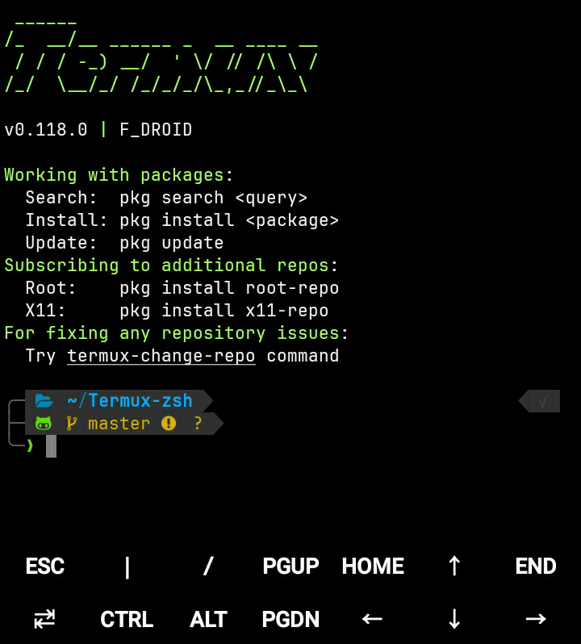

# Termux-ZSH

\

##

### What it does

-   Installs zsh and sets it as default shell.
-   Installs [OhMyZsh](https://github.com/ohmyzsh/ohmyzsh) framework for plugins and themes.
-   Installs customized [powerlevel10k](https://github.com/romkatv/powerlevel10k) theme and sets [JetBrains Mono Nerd font](https://github.com/ryanoasis/nerd-fonts/tree/master/patched-fonts/JetBrainsMono) as default.
-   Added color scheme and font changer scripts in `~/.termux/` directory to change color schemes and fonts in termux easily.
-   Installs syntax highlighter and autosuggestion plugins (from [zsh-users](https://github.com/zsh-users)).
-   Enabled plugins by default `alias-finder command-not-found git node npm zsh-autosuggestions zsh-syntax-highlighting`, to check their usage and more available plugins [Go Here](https://github.com/ohmyzsh/ohmyzsh/wiki/Plugins)
-   Installs and sets up [lf (Terminal file manager)](https://github.com/gokcehan/lf), press <kbd>Ctrl</kbd> + <kbd>O</kbd> to execute lf in current directory (NOTE, last directory location is preserved in current session on quiting lf, so the directory you were in when you quit lf becomes your current terminal directory, if you don't want this for some reason just search for `bindkey -s "^o" "lfcd\C-m"` in `~/.zshrc` file and just change `lfcd` to `lf` in there).
-   Added command edit function, press <kbd>Ctrl</kbd> + <kbd>E</kbd> to edit any command in micro text editor (you can change it to whatever text editor you prefer in `~/.zshrc` file here `export VISUAL="micro"`.

### Notes

-   Termux from playstore [is no longer updated](https://wiki.termux.com/wiki/Termux_Google_Play), install termux from [f-droid](https://f-droid.org/en/packages/com.termux) or from their [github releases](https://github.com/termux/termux-app/releases) instead.
-   To run commands in termux from other apps or open it in a directory with a filemanager ([Mixplorer](https://forum.xda-developers.com/t/app-2-2-mixplorer-v6-x-released-fully-featured-file-manager.1523691/) for example) give it App on top or draw over other apps permission and uncomment `allow-external-apps` and make sure it's set to `true` in `~/.termux/termux.properties`, However keep in mind that any app that supports this functionality can then automatically execute commands in termux so its very unsafe and should be only set to true when necessary.
-   You can set custom aliases or override any alias you want by setting them in `OhMyZsh/custom_aliases.zsh` before installing termux-zsh, or in `~/.oh-my-zsh/custom/custom_aliases.zsh` after installing it.
-   By default all `commit` aliases of git plugin now use verbose flags for some reason, that ends up inserting huge verbose diff in commit message, if you don't want that behaviour for any git commit aliases you can re set them as specified in above note in the `custom_aliases.zsh` file, im overriding `gc` alias in there by default to remove the verbose flag, you can use that as example and set yours in that file, you need to reload (`omz reload`) or restart termux after setting them.
-   You can use `color-changer` alias to change color scheme and `font-changer` alias to change font easily.
-   Checkout [OhMyZsh Cheatsheet](https://github.com/ohmyzsh/ohmyzsh/wiki/Cheatsheet) for some quick usefull tricks.
-   Checkout [OhMyZsh Wiki](https://github.com/ohmyzsh/ohmyzsh/wiki/Home) to see how to customize it, add plugins and themes.
-   Checkout [lf-basics](https://github.com/gokcehan/lf/wiki/Tutorial#basics) to learn how to use the lf file manager and customize it.

### Installation

-   First update termux packages to latest versions by entering `pkg update` , you can answer `Y` to any prompts afterwards if its a clean termux install.
-   Install git `pkg install git`
-   Clone this repo and cd to dir `git clone https://github.com/Sohil876/Termux-zsh.git && cd Termux-zsh`
-   Run setup file with bash `bash setup.sh`
-   It will ask for storage permission, give it.
-   Restart termux after setup is done.
-   On first start it will fetch and setup some things in background, leave it for a minute and its done.

### Update

-   You can use `omz update` command in termux to update OhMyZsh framework/plugins manually to latest versions, by default it will prompt you automatically if it finds any update available.
-   You can use `p10k-update` command in termux to check and update powerlevel10k theme to latest version, this has to be done manually.
-   You can use `custom-plugins-update` command in termux to check and update all plugins installed in `~/.oh-my-zsh/custom/plugins` directory to latest versions (they need to be a git repo), this has to be done manually.
