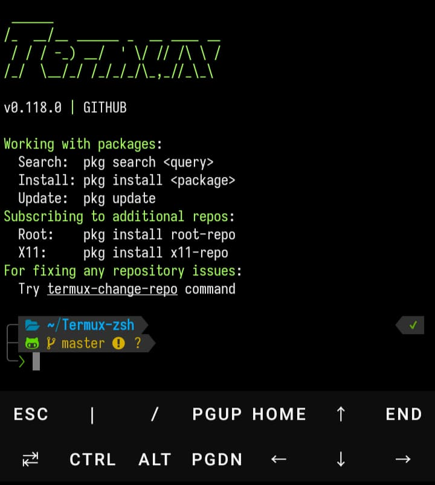

# Termux-ZSH

[English](./README.md)
&nbsp;&nbsp;| &nbsp;&nbsp;
简体中文

\
[](https://app.codacy.com/gh/CMSZ001/Termux-zsh/dashboard?utm_source=gh&utm_medium=referral&utm_content=&utm_campaign=Badge_grade)

##



### 它能做什么

*   安装 zsh 并将其设置为默认 shell。
*   为插件和主题安装 [OhMyZsh](https://github.com/ohmyzsh/ohmyzsh) 框架。
*   安装自定义的 [powerlevel10k](https://github.com/romkatv/powerlevel10k) 主题，并将 [JetBrains Mono Nerd 字体](https://github.com/ryanoasis/nerd-fonts/tree/master/patched-fonts/JetBrainsMono)设置为默认字体。
*   在 `~/.termux/` 目录中添加了配色方案和字体更改脚本，以轻松更改 termux 中的配色方案和字体。
*   安装语法高亮和自动建议插件（来自 [zsh-users](https://github.com/zsh-users)）。
*   默认 `alias-finder command-not-found git node npm zsh-autosuggestions zsh-syntax-highlighting` 启用插件 ，要检查它们的使用情况和更多可用插件，[请转到此处](https://github.com/ohmyzsh/ohmyzsh/wiki/Plugins)
*   安装并设置 [lf（终端文件管理器）](https://github.com/gokcehan/lf)，按 <kbd>Ctrl</kbd> + <kbd>O</kbd> 在当前目录中执行 lf（注意，退出 lf 时，最后一个目录位置保留在当前会话中，因此您退出 lf 时所在的目录将成为您当前的终端目录，如果您出于某种原因不想要，只需在 `~/.zshrc` 文件中搜索 `bindkey -s “^o” “lfcd\C-m”`，然后在那里将 `lfcd` 更改为 `lf`）。
*   添加了命令编辑功能，按 <kbd>Ctrl</kbd> + <kbd>E</kbd> 可以在微文本编辑器中编辑任何命令，您可以在此处将 `~/.zshrc` 文件更改为您喜欢的任何文本编辑器 `export VISUAL=“micro”。`

### 笔记

*   来自 PlayStore 的 Termux [不再更新](https://wiki.termux.com/wiki/Termux_Google_Play)，请从 [f-droid](https://f-droid.org/en/packages/com.termux) 或他们的 [Github Releases](https://github.com/termux/termux-app/releases)安装 termux。
*   要从其他应用程序在 termux 中运行命令或在带有文件管理器（例如 [Mixplorer](https://forum.xda-developers.com/t/app-2-2-mixplorer-v6-x-released-fully-featured-file-manager.1523691/)）的目录中打开它，请将其放在顶部或绘制其他应用程序权限并取消注释 `allow-external-apps` 并确保它在 `~/.termux/termux.properties` 中设置为 `true`，但是请记住，任何支持此功能的应用程序都可以在 termux 中自动执行命令，因此它非常不安全，只应在必要时设置为 true。
*   你可以设置自定义别名或覆盖任何你想要的别名，方法是在安装 termux-zsh 之前在 `OhMyZsh/custom_aliases.zsh` 中设置它们，或者在安装 `~/.oh-my-zsh/custom/custom_aliases.zsh` 之后设置它们。
*   默认情况下，由于某种原因，git 插件的所有`提交`别名现在都使用详细标志，这最终会在提交消息中插入大量详细的差异，如果你不希望任何 git 提交别名出现这种行为，你可以按照上面注释中的 `custom_aliases.zsh` 文件中的指定重新设置它们，im 默认覆盖那里的 `gc` 别名以删除详细标志， 你可以以它为例，并在该文件中设置你的，你需要重新加载 （`omz reload`） 或在设置它们后重新启动 termux。
*   您可以使用`颜色转换器`别名来更改颜色方案，使用`字体转换器`别名来轻松更改字体。
*   查看 [OhMyZsh Cheatsheet](https://github.com/ohmyzsh/ohmyzsh/wiki/Cheatsheet) 以获取一些快速有用的技巧。
*   查看 [OhMyZsh Wiki](https://github.com/ohmyzsh/ohmyzsh/wiki/Home) 了解如何自定义它、添加插件和主题。
*   查看 [lf-basics](https://github.com/gokcehan/lf/wiki/Tutorial#basics) 了解如何使用 lf 文件管理器并对其进行自定义。

### 安装

*   首先输入 `apt update` 将 termux 包更新到最新版本，如果是干净的 termux 安装，您可以在之后对任何提示回答 `Y`。
*   安装 git `apt install git`
*   克隆此存储库并将 cd 复制到 dir `git clone https://github.com/CMSZ001/Termux-zsh.git && cd Termux-zsh`
*   使用 bash `bash setup.sh`安装文件 setup.sh
*   它会请求存储权限，请授权给Termux。
*   设置完成后重新启动 Termux。
*   第一次启动时，它会在后台获取并设置一些东西，静置一分钟就完成了。

### 安装命令
* Github
```bash
apt update && apt install -y git && git clone https://github.com/CMSZ001/Termux-zsh.git && cd Termux-zsh && bash setup.sh
```
* Gitee
```bash
apt update && apt install -y git && git clone https://github.com/CMSZ001/Termux-zsh.git && cd Termux-zsh && bash setup.sh
```

### 更新

*   您可以使用 Termux 中的 `omz update` 命令手动将 OhMyZsh 框架/插件更新到最新版本，默认情况下，如果找到任何可用的更新，它会自动提示您。
*   您可以在 Termux 中使用 `p10k-update` 命令来检查并将 powerlevel10k 主题更新到最新版本，这必须手动完成。
*   您可以在 termux 中使用 `custom-plugins-update` 命令来检查并更新安装在 `~/.oh-my-zsh/custom/plugins` 目录中的所有插件到最新版本（它们是 git 存储库），这必须手动完成。
